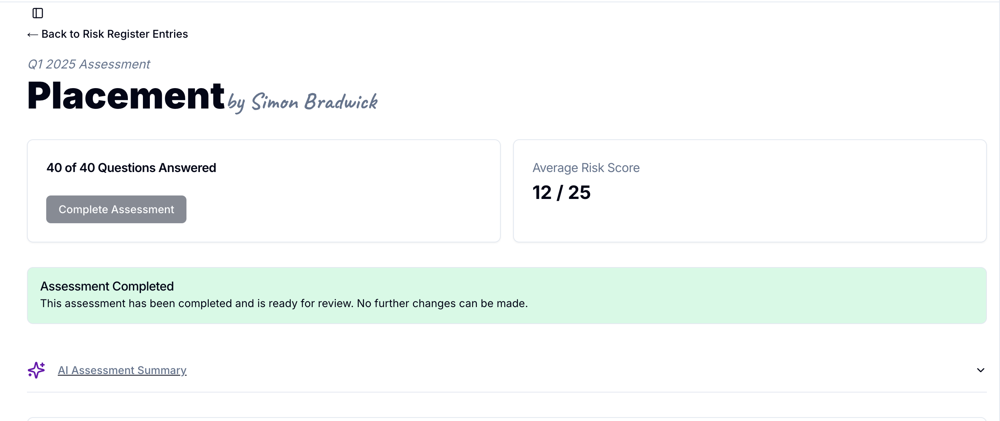

<Warning>
	These Docs are under active development and may change frequently. Please
	check back later for the final version.
</Warning>

The Risk Register is the central repository for capturing and tracking emerging and ongoing risks across the business each quarter. It gives the Risk Committee and senior leaders a clear, auditable view of issues, owners, mitigations and progress so we can prioritise actions and reduce exposure.

## Quick link

Open a new assessment: https://tools.tcifutures.co.uk/admin/risk-register/new

## Getting started — create a new Assessment

<Steps>
  <Step title="Open the Risk Register">
    Go to the link above and click "Create New Assessment".
  </Step>

<Step title='Select quarter and area'>
	Choose the correct quarter and the area of the business you are reporting on.
	The person responsible for that business area (the area lead) should create
	the assessment. Once created, the area lead can share the assessment link with
	team members for input or help completing specific fields.
</Step>

<Step title='Complete the form'>
	All questions are mandatory and have been set by the Risk Committee to ensure
	consistent reporting. Users must complete the form using the existing
	structure and scoring — questions, scales and score calculations are fixed and
	cannot be changed or customised.
</Step>

    <Step title="Save and continue">
    	Click Save after each question — progress is preserved and you can return later to finish.
    </Step>

</Steps>

## What to include for each risk

For each entry in the assessment the risk title and description are preset by the Risk Committee. You do not create or rename risks — simply select the appropriate scores and add context.

- Likelihood — select 1-5 using the fixed scale in the form.
- Impact — select 1-5 using the fixed scale in the form.
- Comments / Evidence — required: add any additional context, references, supporting links or incident/ticket IDs.
- Mitigation actions — optional: add actions if you have planned or in-progress mitigations (include owner and due date).

Note: the questionnaire, numeric scales and overall score calculation are defined by the Risk Committee and are mandatory. You cannot add questions or change the scoring method; use the provided 1–5 Likelihood and Impact scales exactly as presented in the form.

## Scoring guidance

Use a consistent approach when selecting Likelihood and Impact. A simple matrix helps with prioritisation:

- High likelihood + High impact = Immediate attention and escalation.
- High impact + Low likelihood = Monitor and strengthen controls.
- Low impact + Low likelihood = Record and review quarterly.

If helpful, include an estimated financial value for impact and any regulatory or compliance implications.

Impact scores:

- 1 — Nil and no reputational impact
- 2 — Under £10,000 and no reputational impact
- 3 — £10,000 - £24,999 and no reputational impact
- 4 — £25,000 - £49,999 or medium reputational impact that could affect certain clients
- 5 — £50,000 - £99,999 or high reputational impact that could affect parts of the company

## Answering the questions — practical tips

<Warning>
	You must answer all questions in every category to complete the assessment.
</Warning>

- Write in plain language so non-specialists can understand the issue quickly.
- Be specific about dates, systems, teams and vendors referenced.
- For mitigations, state clearly whether actions are planned, in progress or complete.
- Link to evidence (logs, incident reports, contracts) in the Evidence / Notes field.

<Info>
	For each question you must click the Save button. Your progress is always
	saved and you can return to the risk register at any time to complete or
	update your assessment.
</Info>

<Tip>
	Use the sidebar filter to show only unanswered questions — this focuses work
	and reduces repetition.
</Tip>

## Completing the assessment and review process

<Frame>
	
</Frame>

To complete an assessment:

1. Ensure every question has been answered and ownership and due dates are assigned.
2. Click the "Complete" button to submit the assessment to the Risk Committee for review.

<Check>
	Once you click Complete, the Risk Committee will receive the submission for
	triage and discussion at the next quarterly meeting.
</Check>

## After submission — committee review and follow up

- The Committee reviews all completed assessments, validates scores and may reassign owners.
- High priority items will be tracked and may require monthly updates until closed.
- The Committee may request additional evidence, mitigation plans or interim controls.

### AI summary

After you complete the assessment the tool will generate an AI summary of the risks identified. The AI summary is a starting point for the Committee — members must validate and, if necessary, refine the summary before it becomes an official record.

## Examples (brief)

- Example title: "Loss of access to core trading platform"

  - Likelihood: Medium
  - Impact: High (downtime costs, regulatory reporting delays)
  - Controls: DR runbooks, backup providers, incident response team
  - Action: Test DR plan by 2025‑11‑15 — Owner: IT Resilience Lead

- Example title: "Key supplier insolvency"
  - Likelihood: Low
  - Impact: High (supply chain disruption)
  - Controls: Secondary suppliers identified, contract retention clauses
  - Action: Complete supplier resilience assessment — Owner: Procurement — Due: 2025‑12‑01

## Useful contacts and escalation

- If you are unsure who should own a risk, contact your line manager.
- For questions about the register itself, contact the Risk Committee secretariat (via your manager).
